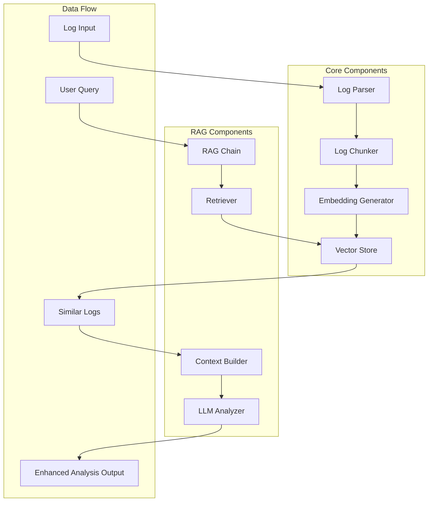
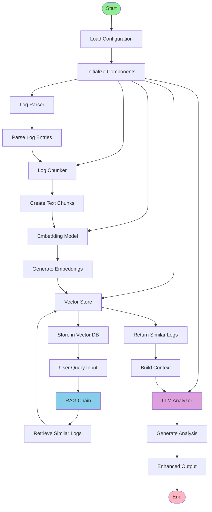
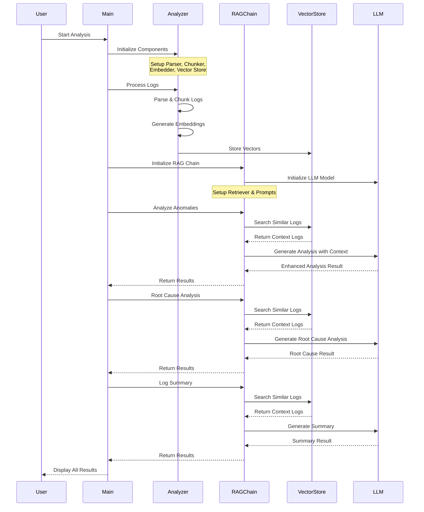
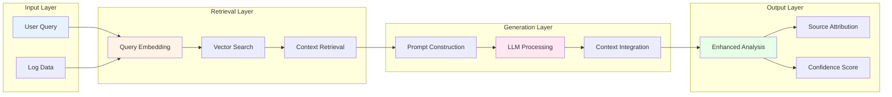
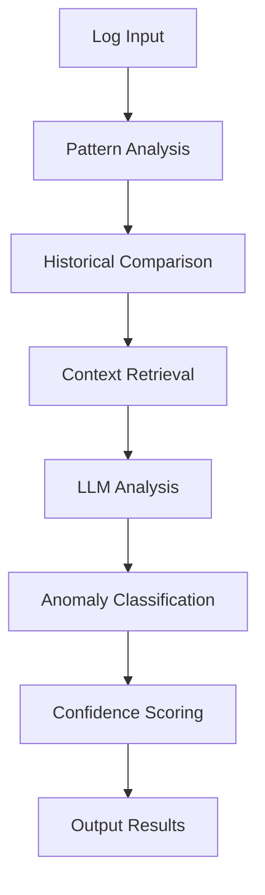
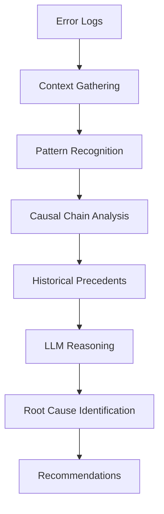
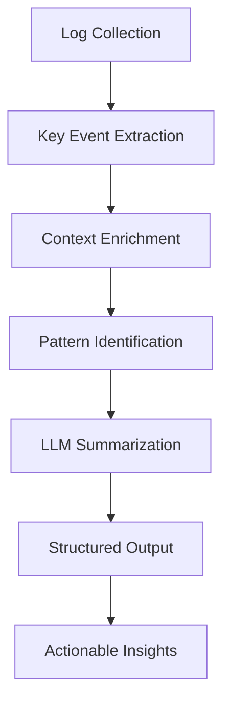

# Smart Log Analyzer - RAG Stage 1 Implementation

This document describes the RAG (Retrieval-Augmented Generation) Stage 1 implementation of the Smart Log Analyzer system, including detailed flow charts and sequence diagrams.

## System Overview

The RAG Stage 1 implementation enhances traditional log analysis by combining:
- **Retrieval**: Semantic search through historical log data using vector embeddings
- **Generation**: LLM-powered analysis with context from retrieved similar logs
- **Context Awareness**: Analysis that considers patterns and historical context

## Architecture Flow Chart



## Detailed Component Flow



## Sequence Diagram - RAG Analysis Process



## RAG Chain Detailed Flow



## Key Components Description

### 1. LogRetriever
- **Purpose**: Custom retriever for log analysis context
- **Function**: Retrieves relevant historical logs based on semantic similarity
- **Configuration**: Configurable number of results (default: 5)

### 2. LogAnalysisRAGChain
- **Purpose**: Main RAG implementation orchestrator
- **Features**:
  - Anomaly detection with context
  - Root cause analysis
  - Log summarization
  - Pattern recognition

### 3. Vector Store Integration
- **Supported Stores**: ChromaDB, Qdrant
- **Search Method**: Semantic similarity search
- **Context Retrieval**: Top-k most similar log entries

## Analysis Types

### 1. Anomaly Detection


### 2. Root Cause Analysis


### 3. Log Summarization


## Configuration Parameters

### LLM Configuration
```yaml
llm:
  model_name: "gemini-pro"
  temperature: 0.1
  max_output_tokens: 512
  top_p: 0.8
  top_k: 40
```

### RAG Configuration
```yaml
rag:
  retrieval_k: 3
  context_window: 1000
  similarity_threshold: 0.7
```

## Performance Metrics

- **Retrieval Accuracy**: Measured by relevance of retrieved context
- **Generation Quality**: LLM output quality and consistency
- **Response Time**: End-to-end analysis time
- **Context Utilization**: How effectively retrieved context is used

## Future Enhancements (Stage 2)

- **Multi-modal Analysis**: Support for different log formats
- **Real-time Processing**: Streaming log analysis
- **Advanced Prompting**: Dynamic prompt generation
- **Feedback Loop**: Learning from user corrections
- **Multi-LLM Support**: Ensemble of different models

## Troubleshooting

### Common Issues
1. **API Key Errors**: Ensure GOOGLE_API_KEY is set correctly
2. **Vector Store Issues**: Check database connectivity
3. **Memory Issues**: Adjust chunk size and retrieval parameters
4. **LLM Timeouts**: Increase timeout values in configuration

### Debug Mode
Enable debug logging by setting log level to DEBUG in configuration:
```yaml
logging:
  level: "DEBUG"
  enable_trace: true
```

## Conclusion

The RAG Stage 1 implementation provides a solid foundation for intelligent log analysis by combining retrieval capabilities with generative AI. This approach significantly improves analysis accuracy and provides context-aware insights that traditional methods cannot achieve.

The system is designed to be extensible, allowing for future enhancements while maintaining the core RAG architecture that makes it effective for production log analysis scenarios.
